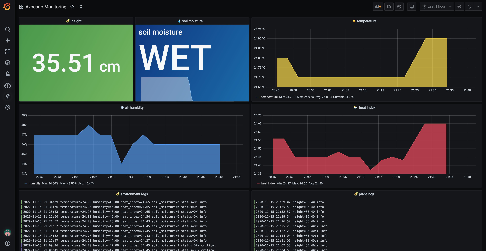

# Avocado Monitoring System 🥑
This fun project was created during Grafana hack days and is follow up on my [sourdough starter monitoring system](https://github.com/ivanahuckova/sourdough_monitor). 
I am using InfluxDB to store metrics. to store logs, I am using Loki. And everything is visualised in Grafana.

